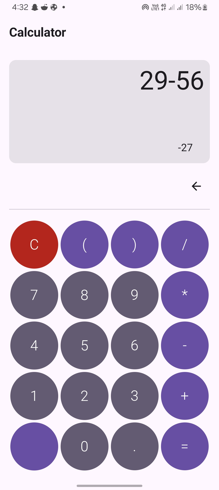
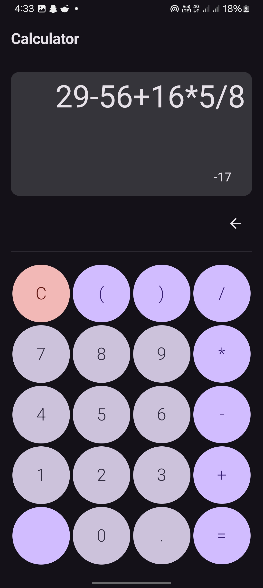

# 📱 Android Calculator App

A simple calculator Android app built using Kotlin in Android Studio.  
Handles basic arithmetic operations and demonstrates clean architecture.

## 🚀 Features

- Basic arithmetic operations: add, subtract, multiply, divide
- Clean and minimal UI
- Built with Android Studio + Kotlin

## 🧰 Tools Used

- Kotlin
- Android Studio
- Git & GitHub

## 📸 Screenshots

   
   

## 🛠️ Installation

1. Clone the repo  
   `git clone https://github.com/Konadu-Prince/android-calculatorkt-app.git`
2. Open in Android Studio
3. Run on your emulator or device

## 🤝 Contributing

Pull requests are welcome! Fork the repo and make magic happen.

## 📄 License

This project is open source. Free to use, modify, or improve.
